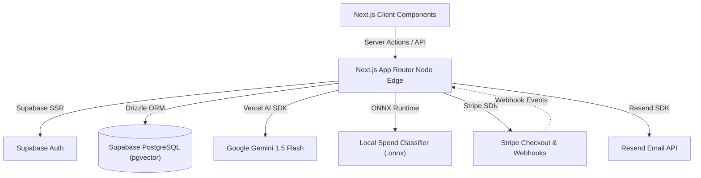

<div align="center">
  
  
  <h1>Huddle</h1>
  <p><strong>The Social Finance Tracker for Gen Z</strong></p>

  <div>
    
    
    
    
    
    
    
    
  </div>
</div>

<br />

Huddle transforms boring expense logging into a highly gamified, socially accountable experience. Designed with premium "Vengeance UI" aesthetics, Huddle makes saving money feel like leveling up alongside your squad.


## ✨ Core Features

* **AI Receipt Scanning**: Snap a picture of a receipt or payment screenshot, and our Gemini 1.5 Flash integration automatically extracts the merchant, amount, category, and date.
* **Social Savings Pods**: Join or create public/private "Pods" to save towards a common goal with friends (e.g., "Goa Trip 2026"). Compete on realtime leaderboards based on group contributions.
* **AI Money Coach (Agentic Chat)**: A personalized AI coach powered by the Vercel AI SDK and Google Gemini. Features include:
  * **RAG (Retrieval-Augmented Generation)**: Uses Supabase `pgvector` to answer questions grounded in your actual financial transactions.
  * **Local Spend Classification**: Uses an ONNX model (`onnxruntime-node`) for fast spend categorization with a Gemini fallback mechanism.
  * **Tool Calling Loop**: The agent can dynamically fetch balances, goal progress, and run savings projections.
* **Gamification & Streaks**: Maintain daily streaks for logging expenses, building extreme financial accountability.
* **Weekly Recaps**: Generate highly shareable, Instagram-ready "Vibe Check" recap cards summarizing your spending behavior.

## 🏗 System Architecture



## 🛠 Enterprise Tech Stack

Huddle is built to scale gracefully, utilizing modern, edge-ready infrastructure:

* **Framework**: [Next.js 15 (App Router)](https://nextjs.org/) for highly optimized, SEO-friendly SSR applications.
* **Language**: Strictly typed [TypeScript](https://www.typescriptlang.org/).
* **Styling**: [Tailwind CSS](https://tailwindcss.com/) + [shadcn/ui](https://ui.shadcn.com/) configured with custom Huddle dark-mode design tokens.
* **Database & Auth**: [Supabase (PostgreSQL)](https://supabase.com/) and Supabase SSR for robust authentication and row-level security.
* **ORM**: [Drizzle ORM](https://orm.drizzle.team/) for extreme type safety and performance.
* **AI Engine**: [Vercel AI SDK](https://sdk.vercel.ai/) + Google Gemini 1.5 Flash.

## 🚀 Quick Start Guide

### Prerequisites
* Node.js v20.0+
* An active Supabase project
* A Google Gemini API Key

### Local Development Setup

1. **Clone the repository**
   ```bash
   git clone https://github.com/Paramveersingh-S/Huddle.git
   cd huddle
   ```

2. **Install dependencies**
   ```bash
   npm install
   ```

3. **Environment Configuration**
   Create a `.env.local` file in the root directory:
   ```env
   NEXT_PUBLIC_SUPABASE_URL=your_supabase_url
   NEXT_PUBLIC_SUPABASE_ANON_KEY=your_supabase_anon_key
   GOOGLE_GENERATIVE_AI_API_KEY=your_gemini_api_key
   STRIPE_SECRET_KEY=your_stripe_secret
   STRIPE_WEBHOOK_SECRET=your_stripe_webhook_secret
   RESEND_API_KEY=your_resend_api_key
   ```

4. **Initialize Database**
   Push the schema directly to your Supabase PostgreSQL instance:
   ```bash
   npx drizzle-kit push
   ```

5. **Start Development Server**
   ```bash
   npm run dev
   ```
   *The application will be accessible at `http://localhost:3000`.*

## 🔒 License

Proprietary Software. All rights reserved by the Huddle Development Team.
